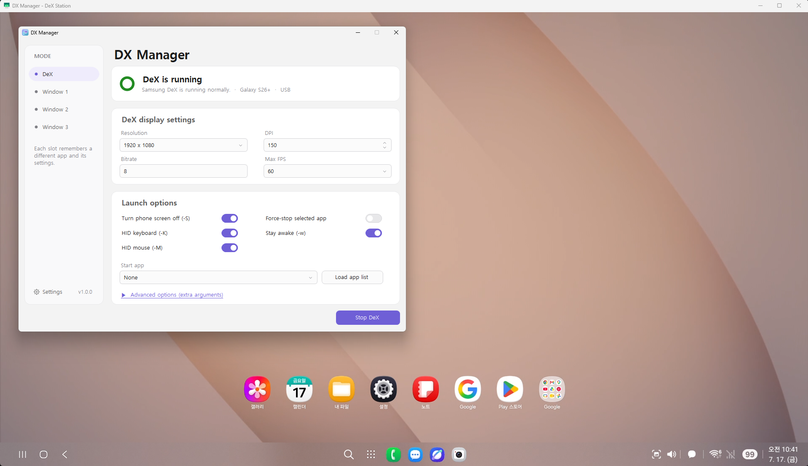
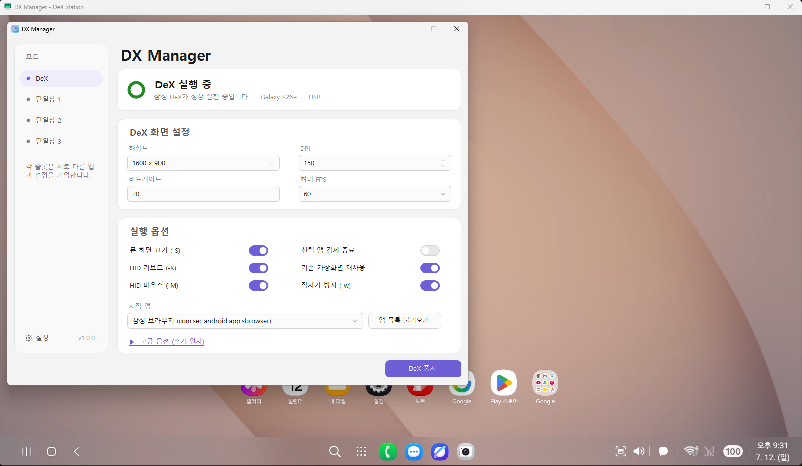

  

<h1 align="center">DX Manager</h1>

  Manage a Samsung DeX virtual display and up to three independent Android app windows from Windows.

  Samsung DeX 가상 화면과 앱별 단일창 3개를 Windows에서 관리하는 데스크톱 도구입니다.

  <a href="#english">English</a> ·
  <a href="#korean">한국어</a> ·
  <a href="docs/USER_GUIDE_EN.md">English guide</a> ·
  <a href="docs/USER_GUIDE_KO.md">한국어 사용 설명서</a> ·
  <a href="docs/FAQ_EN.md">FAQ</a> ·
  <a href="docs/FAQ_KO.md">Q&amp;A</a> ·
  <a href="DexManager/licenses/THIRD_PARTY_NOTICES.md">Third-party notices</a>

  

## Overview

DX Manager is a Windows utility built around Samsung DeX, ADB, and
[scrcpy](https://github.com/Genymobile/scrcpy). It creates and tracks the
correct DeX virtual display, launches scrcpy against that display, and can
open up to three additional app-specific virtual displays.

The application does not depend on an `adb.exe` registered in the system
`PATH`. It selects and runs a bundled ADB by absolute path.

## Why DX Manager?

After Samsung discontinued DeX for PC, many users were left without an
official way to use the same desktop workflow from Windows.

DX Manager was created as a practical alternative built around Samsung DeX,
scrcpy, and ADB. It adds automation and quality-of-life features shaped by
real daily use.

The goal is not to replace scrcpy. DX Manager makes Samsung DeX and scrcpy
easier and more convenient to use together on Windows.

## Project Background

DX Manager began as a personal collection of Batch scripts, CMD commands,
and AutoHotkey automation.

As its features grew through daily use, it was rewritten as a native C#
Windows application to improve usability, stability, maintainability, and
distribution.

## Features

- Start and stop one Samsung DeX virtual display
- Open three independently configured single-app windows
- USB and wireless ADB connections
- Wi-Fi address detection and Android 11+ pairing
- Per-window resolution, DPI, bitrate, FPS, and app selection
- Shared history of successfully launched apps
- HID keyboard and mouse support
- Korean/English key correction and Enter/Shift+Enter switching
- Full scrcpy-window and selected-region capture
- Optional capture transfer to the phone
- Automatic hiding to the system tray after the configured idle period
- Light, dark, and Windows-following themes
- Automatic Korean/English UI selection
- Session logs and environment diagnostics
- 64-bit Windows 7 SP1 compatibility through .NET Framework 4.6.2

## Design Philosophy

Every feature in DX Manager was added to solve a problem encountered during
real Samsung DeX use. The project prioritizes:

- Stability over feature count
- Automation over repetitive manual work
- Practical usability over unnecessary complexity

## Requirements

- 64-bit Windows 7 SP1, 8.1, 10, or 11 (32-bit Windows is not supported)
- .NET Framework 4.6.2 or later
- Windows 7/8.1: Universal CRT updates required by the bundled legacy ADB
- A Samsung device that supports Samsung DeX
- Android Developer options and USB debugging enabled
- A data-capable USB cable for initial authorization

Wireless ADB additionally requires the PC and phone to communicate on the
same local network. Guest Wi-Fi, AP isolation, VLAN rules, or corporate
network policies may block the connection.

## Quick Start

1. Download the release ZIP and extract the entire folder to a user-writable
   location. Avoid protected folders such as `Program Files` unless write
   permission is configured.
2. Enable Developer options and USB debugging on the phone.
3. Connect the phone over USB and approve the RSA debugging prompt.
4. Run `DXManager.exe`.
5. Wait for the connected-device status, then select **Start DeX**.

Do not copy only `DXManager.exe`. The adjacent `tools`, DLL, license, and
scrcpy server files are required.

For complete instructions, see:

- [한국어 사용 설명서](docs/USER_GUIDE_KO.md)
- [English user guide](docs/USER_GUIDE_EN.md)
- [한국어 자주 묻는 질문](docs/FAQ_KO.md)
- [English FAQ](docs/FAQ_EN.md)

## Default Shortcuts

| Shortcut | Action |
| --- | --- |
| `F8` | Enter capture mode while a scrcpy window is active |
| `F8` again | Capture the scrcpy client area |
| Mouse drag | Capture a selected region |
| `Esc` | Cancel capture mode |
| `Left Alt+F8` | Exit DX Manager |
| `Scroll Lock` | Toggle normal Enter / Shift+Enter mode when enabled |

The capture and exit shortcuts are configurable.

## Keyboard Compatibility

scrcpy 4.0 migrated its Windows client from SDL2 to SDL3. On tested systems,
the physical right Shift key is detected by Windows but is not handled
correctly by scrcpy 4.0. scrcpy 3.3.4 does not show this behavior.

While an SDL3-based scrcpy window is active, DX Manager maps physical right
Shift events to left Shift events. This preserves normal Shift typing, but an
Android app cannot distinguish the two Shift sides during that session. The
mapping is not applied to SDL2-based scrcpy versions or other Windows apps.

## Building

- Visual Studio 2019
- .NET Framework 4.6.2 targeting pack
- C# WinForms
- No external NuGet packages

Open `DexManager.sln` and build the `Release` configuration. The output is
written to `DexManager/bin/Release`. To create the public portable folder and
ZIP, run `scripts/Package-Release.ps1`. It keeps the developer output in place
and writes `dist/DX Manager` plus
`dist/DX-Manager-v1.0.0-win-x64.zip`. See
[DexManager/README.md](DexManager/README.md) for packaging notes.

## Project Status

Version 1.0.0 has been tested with:

- Windows 11: USB and wireless DeX, plus three simultaneous single-app windows
- 64-bit Windows 7 SP1 with .NET Framework 4.6.2: core USB workflow and scrcpy 4.0

Hardware, Android versions, network policies, and Samsung firmware can affect
behavior. Use **Settings > Diagnostics** and the session log when reporting a
problem.

## Built On

DX Manager depends on and integrates the following technologies and projects:

- Samsung DeX
- [scrcpy](https://github.com/Genymobile/scrcpy), maintained by Genymobile
  and Romain Vimont
- Android Debug Bridge (ADB) from the Android Open Source Project

Without their work, DX Manager would not exist.

## Trademark and Independence

DX Manager is an independently developed utility. It is not affiliated with,
sponsored by, endorsed by, or distributed by Samsung Electronics or
Genymobile.

Samsung and Samsung DeX are trademarks of Samsung Electronics Co., Ltd.
scrcpy is an independent open-source project maintained by its respective
authors.

## License

DX Manager's original source code is licensed under the
[MIT License](LICENSE). Copyright © 2026
[maze](https://github.com/maze-mei). Bundled third-party components remain
under their own licenses. See
[THIRD_PARTY_NOTICES.md](DexManager/licenses/THIRD_PARTY_NOTICES.md).

---

# 한국어

  

## 개요

DX Manager는 삼성 덱스(Samsung DeX), ADB와
[scrcpy](https://github.com/Genymobile/scrcpy)를 기반으로 동작하는
Windows 유틸리티입니다. 올바른 DeX 가상 디스플레이를 생성하고 추적한 뒤
해당 화면을 scrcpy로 실행하며, 앱별 가상 디스플레이를 최대 3개까지 추가로
열 수 있습니다.

이 프로그램은 시스템 `PATH`에 등록된 `adb.exe`에 의존하지 않습니다.
동봉된 ADB를 자동으로 선택하고 항상 절대 경로로 실행합니다.

## 왜 만들었나요?

Samsung DeX for PC가 종료된 뒤에도 Windows에서 기존과 같은 데스크톱
사용 흐름을 원하는 사용자가 많았습니다.

DX Manager는 Samsung DeX, scrcpy와 ADB를 활용한 실용적인 대안으로
만들어졌습니다. 실제로 매일 사용하면서 필요했던 자동화와 여러 편의 기능을
함께 제공합니다.

이 프로그램의 목표는 scrcpy를 대체하는 것이 아닙니다. Samsung DeX와
scrcpy를 Windows에서 더 쉽고 편리하게 함께 사용할 수 있도록 돕는 것이
목표입니다.

## 프로젝트 배경

DX Manager는 개인적으로 사용하던 Batch 스크립트, CMD 명령과 AutoHotkey
자동화 모음에서 시작되었습니다.

실사용을 거치며 기능이 늘어났고, 사용성·안정성·유지보수성과 배포 편의를
높이기 위해 C# 기반의 Windows 애플리케이션으로 새롭게 개발되었습니다.

## 주요 기능

- Samsung DeX 가상 디스플레이 1개 실행 및 중지
- 각각 독립적으로 설정할 수 있는 앱 단일창 3개
- USB 및 무선 ADB 연결
- Wi-Fi 주소 자동 감지와 Android 11 이상 무선 페어링
- 창별 해상도, DPI, 비트레이트, FPS와 시작 앱 설정
- 성공적으로 실행한 앱을 공통 최근 목록으로 기억
- HID 키보드 및 마우스 지원
- 한영키 보정과 Enter/Shift+Enter 전환
- scrcpy 전체 화면 및 선택 영역 캡처
- 캡처 결과의 휴대폰 전송
- 설정 시간 동안 미입력 시 시스템 트레이 자동 숨김
- 라이트, 다크 및 Windows 설정 연동 테마
- Windows 언어에 따른 한국어·영어 UI 자동 선택
- 실행 세션 로그와 환경 점검
- .NET Framework 4.6.2를 통한 64비트 Windows 7 SP1 호환

## 개발 철학

DX Manager의 모든 기능은 Samsung DeX를 실제로 사용하면서 겪은 문제를
해결하기 위해 추가되었습니다. 다음 원칙을 우선합니다.

- 기능의 개수보다 안정성
- 반복적인 수동 작업보다 자동화
- 불필요한 복잡함보다 실용성

## 요구 사항

- 64비트 Windows 7 SP1, 8.1, 10 또는 11(32비트 Windows는 지원하지 않음)
- .NET Framework 4.6.2 이상
- Windows 7/8.1: 번들 레거시 ADB에 필요한 Universal CRT 업데이트
- Samsung DeX를 지원하는 Samsung 기기
- Android 개발자 옵션 및 USB 디버깅 활성화
- 최초 인증을 위한 데이터 통신 지원 USB 케이블

무선 ADB를 사용하려면 PC와 휴대폰이 같은 로컬 네트워크에서 서로 통신할
수 있어야 합니다. 게스트 Wi-Fi, AP 격리, VLAN 규칙 또는 회사 네트워크
정책으로 연결이 차단될 수 있습니다.

## 빠른 시작

1. 릴리스 ZIP을 내려받아 현재 계정이 쓸 수 있는 위치에 폴더 전체의 압축을
   풉니다. 별도 쓰기 권한을 설정하지 않았다면 `Program Files` 같은 보호
   폴더는 피하십시오.
2. 휴대폰에서 개발자 옵션과 USB 디버깅을 활성화합니다.
3. 휴대폰을 USB로 연결하고 RSA 디버깅 허용 창을 승인합니다.
4. `DXManager.exe`를 실행합니다.
5. 장치 연결 상태가 표시되면 **DeX 시작**을 선택합니다.

`DXManager.exe`만 따로 복사하면 안 됩니다. 함께 제공되는 `tools` 폴더,
DLL, 라이선스 파일과 scrcpy 서버 파일이 모두 필요합니다.

자세한 사용법은 다음 문서를 참조하십시오.

- [한국어 사용 설명서](docs/USER_GUIDE_KO.md)
- [English user guide](docs/USER_GUIDE_EN.md)
- [한국어 자주 묻는 질문](docs/FAQ_KO.md)
- [English FAQ](docs/FAQ_EN.md)

## 기본 단축키

| 단축키 | 동작 |
| --- | --- |
| `F8` | scrcpy 창이 활성화된 상태에서 캡처 모드 진입 |
| `F8` 다시 누름 | scrcpy 화면 영역 캡처 |
| 마우스 드래그 | 선택 영역 캡처 |
| `Esc` | 캡처 모드 취소 |
| `왼쪽 Alt+F8` | DX Manager 종료 |
| `Scroll Lock` | 사용 설정 시 일반 Enter와 Shift+Enter 모드 전환 |

캡처 및 종료 단축키는 설정에서 변경할 수 있습니다.

## 키보드 호환성

scrcpy 4.0의 Windows 클라이언트는 SDL2에서 SDL3로 변경되었습니다. 확인한
환경에서는 Windows가 물리 오른쪽 Shift를 정상 감지하지만 scrcpy 4.0이
해당 입력을 올바르게 처리하지 못했습니다. scrcpy 3.3.4에서는 같은 문제가
발생하지 않았습니다.

DX Manager는 SDL3 기반 scrcpy 창이 활성화된 동안 물리 오른쪽 Shift 입력을
왼쪽 Shift 입력으로 변환합니다. 일반적인 Shift 타이핑은 유지되지만 해당
세션에서 Android 앱은 좌우 Shift를 구분할 수 없습니다. SDL2 기반 scrcpy와
다른 Windows 프로그램에는 이 변환을 적용하지 않습니다.

## 빌드

- Visual Studio 2019
- .NET Framework 4.6.2 Targeting Pack
- C# WinForms
- 외부 NuGet 패키지 없음

`DexManager.sln`을 열고 `Release` 구성으로 빌드합니다. 결과물은
`DexManager/bin/Release`에 생성됩니다. 공개용 포터블 폴더와 ZIP은
`scripts/Package-Release.ps1`을 실행해 만듭니다. 개발 빌드 폴더는 유지하고
`dist/DX Manager`와 `dist/DX-Manager-v1.0.0-win-x64.zip`을 생성합니다. 배포 파일 구성은
[DexManager/README.md](DexManager/README.md)를 참조하십시오.

## 프로젝트 상태

버전 1.0.0은 다음 환경에서 확인했습니다.

- Windows 11: USB 및 무선 DeX, 단일창 3개 동시 실행
- 64비트 Windows 7 SP1 및 .NET Framework 4.6.2: USB 핵심 기능과 scrcpy 4.0

하드웨어, Android 버전, 네트워크 정책과 Samsung 펌웨어에 따라 동작이
달라질 수 있습니다. 문제를 제보할 때는 **설정 > 진단**과 실행 세션
로그를 활용하십시오.

## 기반 기술과 프로젝트

DX Manager는 다음 기술과 프로젝트를 활용하여 만들어졌습니다.

- Samsung DeX
- Genymobile과 Romain Vimont가 개발·관리하는
  [scrcpy](https://github.com/Genymobile/scrcpy)
- Android Open Source Project의 Android Debug Bridge(ADB)

이 기술과 프로젝트가 없었다면 DX Manager도 존재할 수 없었습니다.

## 상표 및 독립성 고지

DX Manager는 독립적으로 개발된 유틸리티입니다. Samsung Electronics 또는
Genymobile과 제휴·후원·보증 관계가 없으며 해당 회사에서 배포하는
프로그램이 아닙니다.

Samsung과 Samsung DeX는 Samsung Electronics Co., Ltd.의 상표입니다.
scrcpy는 해당 개발자들이 유지·관리하는 독립적인 오픈소스 프로젝트입니다.

## 라이선스

DX Manager 자체 소스 코드는 [MIT License](LICENSE)로 배포됩니다.
Copyright © 2026 [maze](https://github.com/maze-mei). 동봉된 제3자
구성요소에는 각각의 라이선스가 적용됩니다. 자세한 내용은
[THIRD_PARTY_NOTICES.md](DexManager/licenses/THIRD_PARTY_NOTICES.md)를
참조하십시오.

## 개발자와 프로젝트

- 개발자: [maze](https://github.com/maze-mei)
- GitHub: [maze-mei/DX-Manager](https://github.com/maze-mei/DX-Manager)
- Copyright © 2026 maze

DX Manager는 개인이 독립적으로 개발한 프로젝트입니다.
