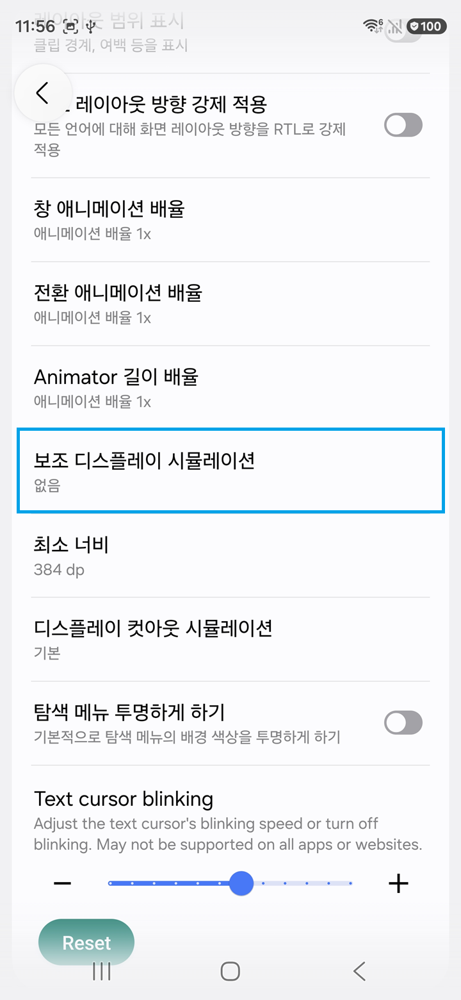
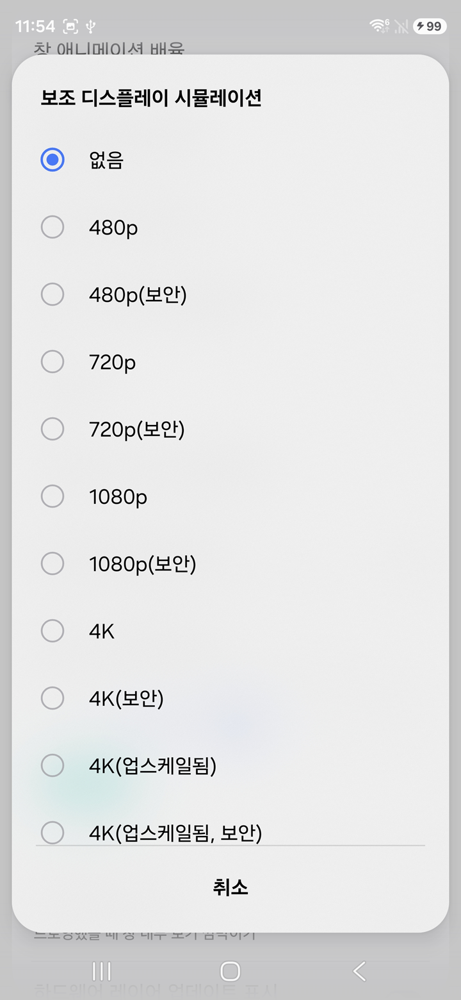

# DX Manager 자주 묻는 질문

[English FAQ](FAQ_EN.md) · [한국어 사용 설명서](USER_GUIDE_KO.md)

## Q1. 휴대폰에 작은 화면(보조 디스플레이)이 남아 있습니다.

DX Manager가 강제 종료되었거나, 정리 명령을 보내기 전에 USB 또는 무선
연결이 완전히 끊기면 Android의 가상 디스플레이 설정이 남을 수 있습니다.
정상적으로 DX Manager를 종료하면 프로그램이 이 설정을 자동으로
제거합니다.

화면이 계속 남아 있다면 휴대폰에서 다음 순서로 제거할 수 있습니다.

1. **개발자 옵션**을 엽니다.
2. **보조 디스플레이 시뮬레이션(Simulate secondary displays)**을
   선택합니다.
3. 아무 해상도 하나를 선택합니다.
4. 메뉴를 다시 열어 선택한 항목을 끄거나 **없음(None)**을 선택합니다.

One UI 버전에 따라 선택된 해상도를 한 번 더 눌러야 꺼지는 경우도
있습니다. 설정이 해제되면 남아 있던 가상 화면이 제거됩니다.

<p align="center">
  
  
</p>

## Q2. 삼성 브라우저를 자동 실행할 때 선택 앱 강제 종료를 사용하는 이유는 무엇인가요?

삼성 브라우저가 휴대폰 화면에서 실행 중인 상태로 DeX 화면에 다시 열리면,
일부 환경에서 한영키 전환이 동작하지 않는 경우가 있습니다. **선택 앱 강제
종료**를 켜면 기존 삼성 브라우저 프로세스를 휴대폰에서 먼저 종료한 뒤 DeX
화면에서 새로 실행하므로 이 문제를 피할 수 있습니다.

이 기능은 브라우저 데이터나 북마크를 삭제하지는 않지만, 저장하지 않은
입력 내용이나 진행 중인 작업은 사라질 수 있습니다. 다른 앱에서는 필요할
때만 사용하십시오.

## Q3. 휴대폰을 두 대 이상 연결하면 어떤 기기를 사용하나요?

DX Manager v1은 한 번에 휴대폰 한 대만 관리합니다. 프로그램 실행 후 처음
선택된 휴대폰이 이번 실행의 대상 기기로 고정됩니다.

- 실행 중 다른 휴대폰을 연결해도 무시합니다.
- 고정된 휴대폰이 분리되어도 다른 휴대폰으로 자동 전환하지 않습니다.
- 원래 휴대폰을 다시 연결하면 같은 기기로 인식합니다.
- 같은 휴대폰의 USB 연결과 무선 ADB 연결 전환은 허용합니다.

다른 휴대폰을 사용하려면 DX Manager를 완전히 종료한 뒤 원하는 휴대폰만
연결하고 다시 실행하십시오. 기기 선택과 여러 휴대폰 동시 제어는 향후 v2
후보 기능입니다.

## Q4. 1600×900보다 낮은 해상도에서 DeX 화면 일부가 잘립니다.

Samsung DeX의 기본 최소 해상도는 1600×900입니다. DX Manager에서는 더
낮은 가상 해상도도 만들 수 있지만, 앱 서랍 상단이 잘리는 등 일부 DeX UI가
작은 화면에 맞게 배치되지 않을 수 있습니다.

앱 실행 자체에는 문제가 없을 수 있으나 전체 DeX UI를 정상적으로 사용하려면
1600×900 이상의 해상도를 권장합니다. 이 현상은 낮은 해상도에 대한 Samsung
DeX UI 제약이며 DX Manager가 화면 일부를 잘라내는 것은 아닙니다.

## Q5. 해상도나 DPI를 바꾸니 바탕화면 아이콘과 배경화면이 달라졌습니다.

Samsung DeX는 해상도와 DPI 조합에 따라 화면 배율과 레이아웃 프로필을 다르게
판정할 수 있습니다. 같은 해상도에서도 DPI가 달라지면 아이콘 크기, 위젯
배치, 편집 가능 상태가 달라질 수 있으며 배경화면도 별도 상태로 관리될 수
있습니다.

따라서 설정을 바꾼 뒤 이전과 다른 바탕화면이 표시되어도 가상 디스플레이를
잘못 선택한 것은 아닐 수 있습니다. 자주 사용할 해상도와 DPI 조합을 정한
뒤 그 조합에서 바탕화면을 구성하는 것이 가장 안정적입니다.

## Q6. 최근 앱 화면이 비정상적으로 보이고 데스크톱 1로 돌아갈 수 없습니다.

일부 해상도/DPI 조합에서는 DeX를 처음 실행한 뒤 최근 앱 화면의 데스크톱
표시가 어긋날 수 있습니다. 다음 방법으로 복구할 수 있습니다.

1. 최근 앱 화면에서 모니터 그림 안의 **+** 버튼을 눌러 새 데스크톱을
   만듭니다.
2. 화면 왼쪽에 일부 보이는 **데스크톱 1**을 선택합니다.

정상 화면으로 돌아오면 같은 DeX 세션에서는 대체로 다시 발생하지 않습니다.
Samsung 펌웨어나 One UI 버전에 따라 화면 구성과 명칭은 달라질 수 있습니다.

## Q7. DPI를 120보다 낮게 설정할 수 없는 이유는 무엇인가요?

확인된 Samsung DeX 환경에서는 DPI 120이 가상 디스플레이를 생성할 수 있는
최솟값입니다. 119 이하에서는 overlay가 만들어지지 않아 새 display ID를
찾을 수 없습니다.

DX Manager는 120보다 작은 값이 입력되면 편집 전 값으로 되돌리고
안내합니다. 반대로 매우 높은 DPI는 생성되더라도 글자와 UI가 지나치게
커져 사용하기 어려울 수 있습니다.

## Q8. 로그의 scrcpy-server 전송 속도가 평소보다 낮게 표시됩니다.

다음과 같은 줄은 scrcpy가 작은 `scrcpy-server` 파일을 휴대폰으로 전송할
때 계산한 순간 속도입니다.

```text
scrcpy-server: 1 file pushed, 0 skipped. 42.9 MB/s
```

파일이 작고 전송 시간이 매우 짧아 수치 변동이 크며, 이 값이 USB 링크의
정확한 속도나 이후 영상 스트리밍 속도를 의미하지는 않습니다. 낮은 숫자만
표시됐다고 연결 오류로 판단할 필요는 없습니다.

다만 DeX 화면까지 버벅이거나 직접 scrcpy를 실행해도 계속 낮게 나온다면
데이터 전송을 지원하는 다른 USB 케이블과 PC의 다른 USB 포트를 시험해
보십시오. 충전 위주 케이블이나 품질이 낮은 케이블이 원인일 수 있습니다.

## Q9. 무선 ADB 연결 또는 자동 재연결이 실패합니다.

다음 항목을 순서대로 확인하십시오.

- PC와 휴대폰이 서로 직접 통신할 수 있는 같은 로컬 네트워크인지 확인
- 게스트 Wi-Fi, AP/클라이언트 격리, VLAN과 회사 방화벽 확인
- 페어링 포트와 실제 연결 포트를 혼동하지 않았는지 확인
- 휴대폰 IP 주소가 바뀌지 않았는지 확인
- 휴대폰 재부팅 후 USB로 무선 연결 준비를 다시 실행
- Android 11 이상 무선 디버깅은 필요하면 다시 페어링

무선 주소가 `adb devices`에 보이더라도 `offline`이면 연결을 끊었다가 다시
연결하십시오. 같은 Wi-Fi 이름을 사용한다는 사실만으로 기기 간 통신이
보장되지는 않습니다.

## Q10. 장치 상태가 unauthorized 또는 offline으로 표시됩니다.

`unauthorized`는 PC의 ADB 키가 아직 휴대폰에서 승인되지 않았다는 뜻입니다.
휴대폰 화면을 켜고 RSA 디버깅 허용 창을 승인하십시오. 창이 나타나지 않으면
USB 디버깅 승인을 취소한 뒤 케이블을 다시 연결하거나 USB 디버깅을 껐다가
켜 보십시오.

`offline`은 장치 항목은 있지만 ADB 명령을 받을 수 없는 상태입니다. 케이블,
USB 포트, 무선 네트워크를 확인하고 연결을 다시 시도하십시오. USB 장치가
계속 나타나지 않으면 Samsung USB 드라이버와 **보안 위험 자동 차단** 설정도
확인하십시오.

## Q11. 오른쪽 Shift를 왼쪽 Shift로 보정하는 이유는 무엇인가요?

Windows용 scrcpy 4.0이 사용하는 SDL3 환경에서는 Windows가 물리 오른쪽
Shift 입력을 정상적으로 감지해도 Android로 전달되지 않는 현상이 확인됐습니다.
scrcpy 3.3.4/SDL2에서는 같은 문제가 발생하지 않았습니다.

DX Manager는 SDL3 기반 scrcpy 창이 활성화된 동안에만 오른쪽 Shift 입력을
왼쪽 Shift로 바꿔 전달합니다. 일반적인 Shift 입력은 사용할 수 있지만 해당
세션의 Android 앱은 좌우 Shift를 구분할 수 없습니다. 다른 Windows 앱과
SDL2 기반 scrcpy에는 이 보정이 적용되지 않습니다.

## Q12. 기기 연결 후 시작 대기와 프로세스 제한시간은 무엇이 다른가요?

**기기 연결 후 시작 대기**는 휴대폰 연결 상태와 기기 이름을 확인한 뒤,
DeX 또는 단일창의 실제 시작 명령을 보내기 전에 의도적으로 기다리는
시간입니다. 범위는 0~60초이고 기본값은 1초입니다. 0으로 설정하면 연결 확인
후 곧바로 시작합니다.

**프로세스 제한시간**은 ADB나 scrcpy 보조 프로세스가 응답하거나 창을 만들
때까지 기다릴 수 있는 최대 시간입니다. 명령이 정상적으로 빨리 끝나면 제한
시간 전체를 기다리지 않습니다. 느린 PC나 장치에서 시간 초과가 반복되는
경우가 아니라면 고급 옵션의 기본값을 바꿀 필요가 없습니다.

## Q13. 사용 중 USB 연결이 갑자기 끊기면 어떻게 처리되나요?

DX Manager는 연결 해제를 확인하면 해당 휴대폰에서 실행하던 DeX와 단일창
세션을 정리합니다. 휴대폰이 사라져 즉시 보낼 수 없는 overlay, 화면 상태와
stay-awake 복구 명령은 같은 휴대폰이 다시 연결됐을 때 재시도할 수 있습니다.

원래 휴대폰이 다시 연결되면 설정된 시작 대기시간을 적용하고, 자동 실행이
켜져 있으면 세션을 다시 시작합니다. 다른 휴대폰이 연결되어 있어도 v1에서는
그 휴대폰으로 자동 전환하지 않습니다.

## Q14. 휴대폰 화면 끄기와 잠자기 방지는 어떻게 다른가요?

**폰 화면 끄기 (`-S`)**는 scrcpy 세션을 실행하는 동안 실제 휴대폰 패널을
끄는 기능입니다. 휴대폰 화면이 꺼져도 DeX 가상 화면과 scrcpy 영상은 계속
동작합니다.

**잠자기 방지**는 세션 사용 중 Android가 잠들거나 연결을 중단하지 않도록
활성 상태를 유지합니다. 여러 DeX/단일창 세션 중 하나라도 화면 끄기 또는
잠자기 방지를 요청하면 DX Manager가 전체 세션 상태를 기준으로 관리합니다.
모든 관련 세션을 종료하거나 DX Manager를 정상 종료하면 휴대폰 화면과
stay-awake 상태의 복구를 시도합니다.

## Q15. 휴대폰을 충전할 때 화면이 계속 켜져 있습니다.

DX Manager가 DeX 또는 단일창 사용 중 적용한 **잠자기 방지 (`-w`)** 설정은
세션이나 프로그램을 정상 종료하면 원래 상태로 복원됩니다.

다만 휴대폰 연결이 끊어진 상태에서 DX Manager를 종료했거나 프로그램이
비정상 종료된 경우에는 ADB 명령을 보낼 수 없어 설정을 복원하지 못할 수
있습니다. 이때는 다음 중 한 가지 방법으로 복구하십시오.

- 휴대폰의 **개발자 옵션 → 절전모드 해제** 항목을 직접 끕니다.
- 같은 휴대폰을 DX Manager에 다시 연결한 뒤 정상적인 방법으로 종료합니다.

이 설정은 USB 또는 충전기에 연결했을 때 화면이 자동으로 꺼지지 않게 할 수
있습니다.

## Q16. Windows 7에서 무엇이 필요하며, DXManager.exe만 복사하면 왜 안 되나요?

DX Manager는 64비트 Windows 7 SP1과 .NET Framework 4.6.2 이상을
지원합니다. 32비트 Windows는 지원하지 않습니다. Windows 7/8.1에서는 번들
레거시 ADB 실행에 필요한 Universal CRT 업데이트와 Samsung USB 드라이버가
필요할 수 있습니다.

`DXManager.exe`는 다음 파일을 함께 사용하므로 실행 파일만 따로 복사하면
정상적으로 동작하지 않습니다.

- `tools` 아래 ADB와 scrcpy 실행 파일
- scrcpy DLL과 `scrcpy-server`
- 한국어 리소스와 설정 파일
- 라이선스 및 제3자 고지 파일

배포 ZIP의 폴더 구조를 그대로 유지하고, 설정·로그·스크린샷을 저장할 수
있는 쓰기 가능한 위치에서 실행하십시오.
