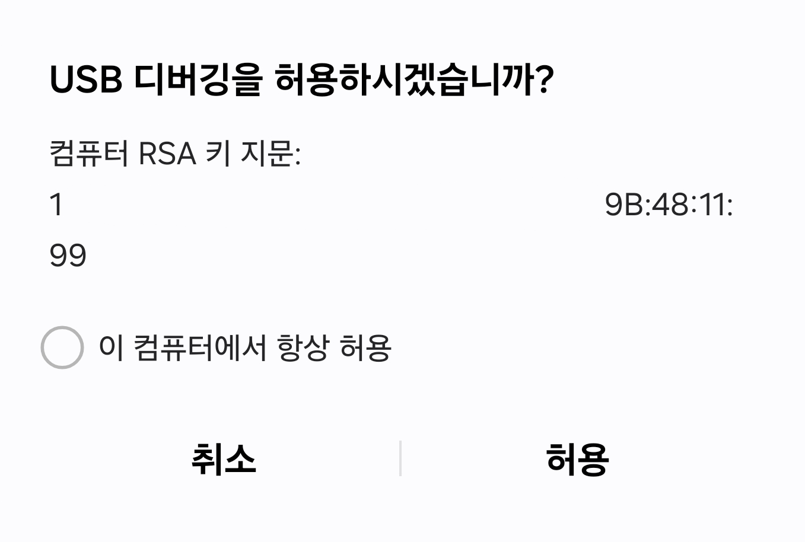
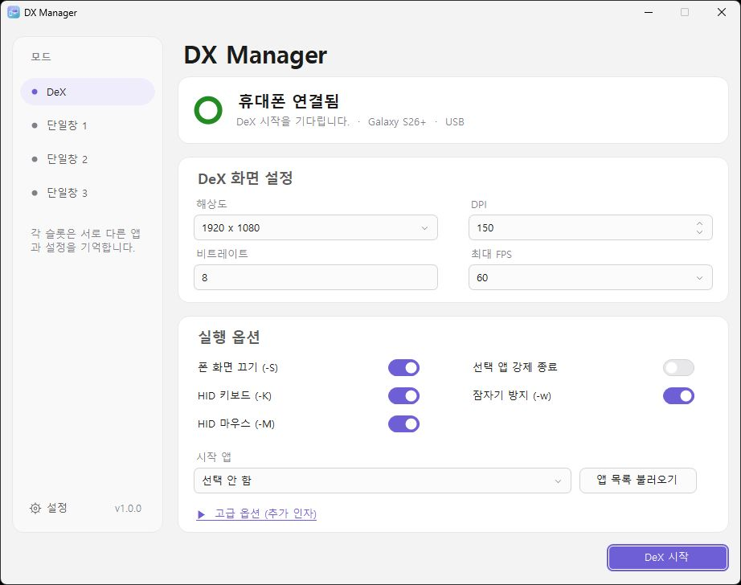
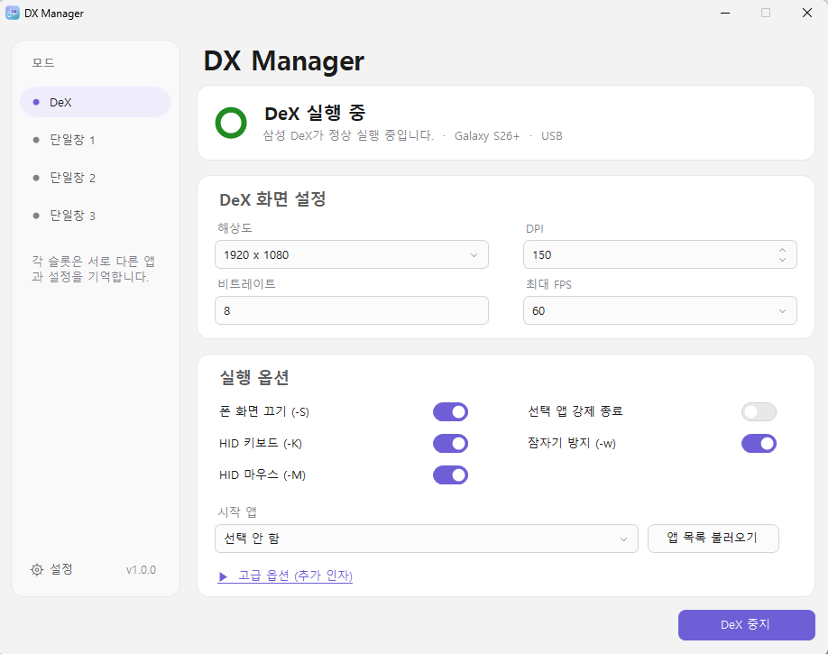
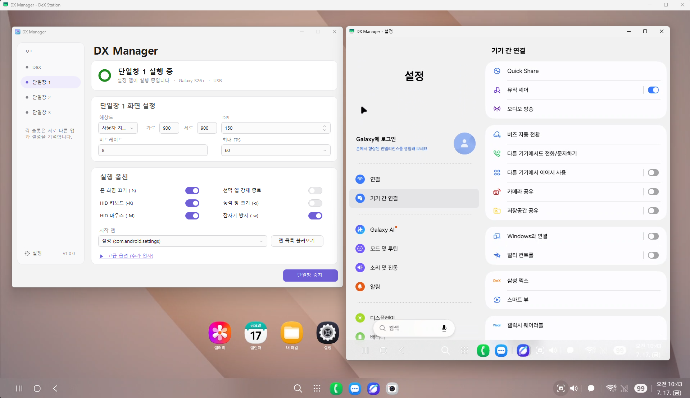
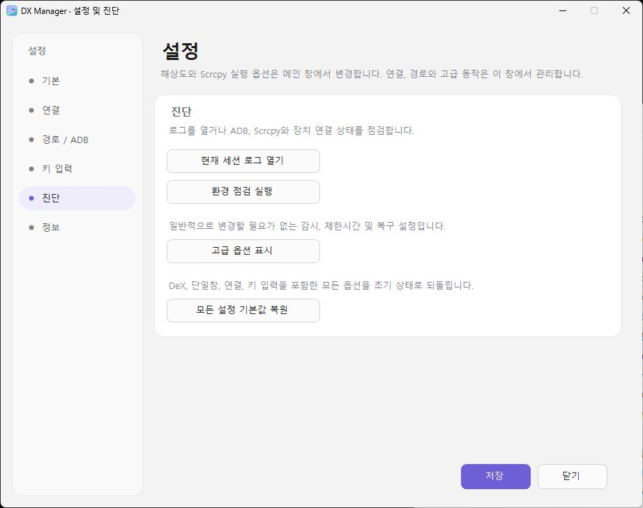
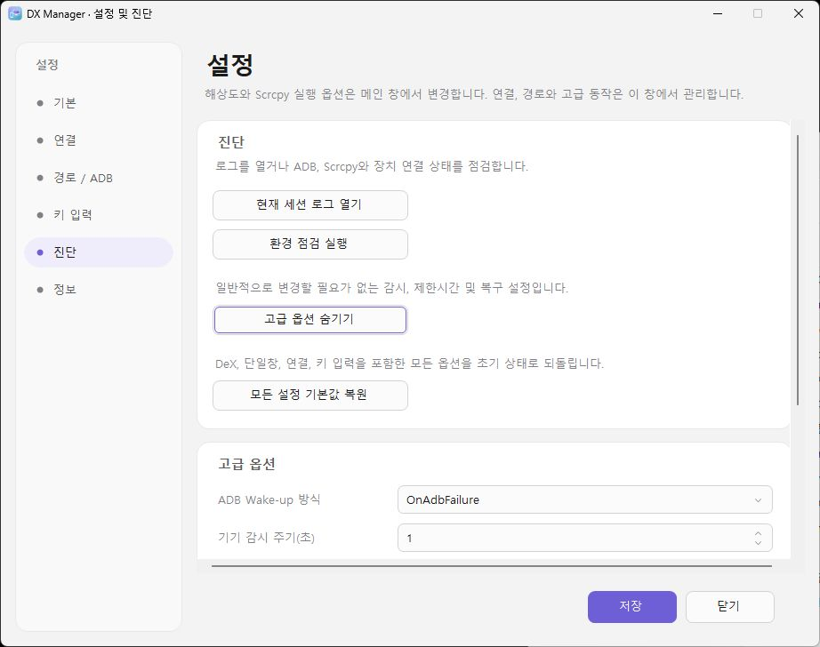
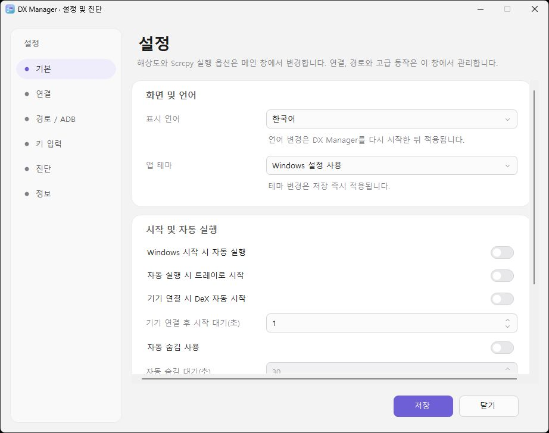

# DX Manager 한국어 사용 설명서

## 1. 준비 사항

### PC

- 64비트 Windows 7 SP1, 8.1, 10 또는 11(32비트 Windows는 지원하지 않음)
- .NET Framework 4.6.2 이상
- Windows 7/8.1: 번들 레거시 ADB에 필요한 Universal CRT 업데이트
- 압축을 해제할 수 있는 충분한 저장 공간
- 실행 파일 옆에 설정·로그·스크린샷을 저장할 수 있는 쓰기 가능한 폴더

### 휴대폰

- Samsung DeX를 지원하고 One UI 7.0 이상이 설치된 Samsung Galaxy 기기
- 개발자 옵션 활성화
- USB 디버깅 활성화
- 데이터 통신이 가능한 USB 케이블

처음 연결할 때 휴대폰에 표시되는 RSA 디버깅 허용 창을 승인해야 합니다.
자주 사용하는 PC라면 **이 컴퓨터에서 항상 허용**을 선택할 수 있습니다.

  

## 2. 설치와 첫 실행

1. 배포 ZIP의 압축을 현재 계정이 쓸 수 있는 폴더에 풉니다. 별도 쓰기
   권한을 설정하지 않았다면 `Program Files` 같은 보호 폴더는 피하십시오.
2. `DXManager.exe`를 실행합니다.
3. Windows 보안 경고가 표시되면 파일의 출처를 확인한 뒤 실행 여부를
   결정합니다.
4. 휴대폰을 USB로 연결하고 RSA 디버깅을 승인합니다.
5. 상단 상태가 휴대폰 연결 상태로 바뀔 때까지 기다립니다.
6. **DeX 시작**을 누릅니다.

  

승인된 USB 또는 무선 기기를 감지하면 DX Manager는 설정된 기기 시작
대기시간이 지난 뒤 세션 시작 명령을 보냅니다. 기본값은 1초이며, 연결 직후
기기 상태가 안정된 다음 scrcpy를 시작하도록 돕습니다.

`DXManager.exe`만 다른 폴더로 복사하면 실행되지 않습니다. `tools` 폴더,
scrcpy DLL, `scrcpy-server`, 라이선스 파일을 포함한 배포 폴더 전체를
유지하십시오.

## 3. DeX 모드

왼쪽 메뉴에서 **DeX**를 선택합니다.

  

### 화면 설정

- **해상도**: 프리셋 또는 사용자 지정 크기
- **DPI**: Android 화면 배율
- **비트레이트**: 영상 품질과 네트워크 사용량
- **최대 FPS**: 30 또는 60fps

DPI 값이 작을수록 화면의 UI 요소가 작아져 한 화면에 더 많은 정보를 표시할
수 있습니다.

사용자 지정 해상도는 프리셋과 별도로 저장됩니다. 다른 프리셋을 선택한 뒤
다시 사용자 지정을 선택해도 마지막 사용자 지정 값이 복원됩니다.

scrcpy 창은 PC 모니터와 창 크기에 맞춰 영상을 자동으로 축소하여 표시합니다.
따라서 PC에서 보이는 창의 크기와 관계없이 실제 DeX 내부 해상도는 DX
Manager에서 설정한 값으로 동작합니다. 사용자 지정 가로·세로 값은 각각
4096까지 입력할 수 있습니다.

### 실행 옵션

- **폰 화면 끄기 (`-S`)**: scrcpy 실행 중 실제 휴대폰 화면 끄기
- **HID 키보드 (`-K`)**: 키보드를 Android 입력 장치로 전달
- **HID 마우스 (`-M`)**: 마우스를 Android 입력 장치로 전달
- **선택 앱 강제 종료**: 앱을 시작하기 전에 기존 프로세스 종료
- **잠자기 방지 (`-w`)**: 실행 중 휴대폰 활성 상태 유지

폰 화면 끄기(`-S`)는 휴대폰을 잠그는 기능이 아니라 활성 상태에서 물리
디스플레이만 끄는 기능입니다. 화면이 꺼져 있어도 터치, 길게 누르기, 지문
인증 등의 입력은 동작할 수 있으므로 의도하지 않은 설정 변경이나 앱 조작에
주의하십시오.

HID 키보드와 HID 마우스를 끄면 scrcpy의 비 HID 입력 방식을 사용합니다.
이때 마우스 입력은 화면을 직접 터치하는 것처럼 전달되며, 마우스 버튼을
누르고 있으면 길게 누르기 동작으로 처리됩니다.

비 HID 키보드는 HID 방식과 일부 동작이 다릅니다. 영문 입력은 가능하지만
한영키가 동작하지 않을 수 있으므로 왼쪽 Shift+Space로 입력 언어를
전환하십시오. Android 키보드와 시스템 설정에 따라 이 조합도 동작하지 않을
수 있습니다.

설정을 변경한 뒤 실행 버튼을 누르면 필요한 경우 기존 DeX 세션을 정리하고
새 설정으로 다시 시작합니다.

## 4. 단일창 모드

왼쪽 메뉴에서 **단일창 1**, **단일창 2**, **단일창 3** 중 하나를
선택합니다. 각 슬롯은 해상도, DPI, 비트레이트, FPS, 앱과 실행 옵션을
독립적으로 기억합니다.

1. **앱 목록 불러오기**를 누릅니다.
2. 시작할 앱을 선택합니다.
3. 화면과 실행 옵션을 설정합니다.
4. **단일창 시작**을 누릅니다.

앱을 자동 실행하지 않으려면 앱 목록의 **선택 안 함**을 선택합니다.

자동으로 정상 실행된 앱은 공통 최근 앱 목록에 저장됩니다. 전체 앱 목록을
다시 불러오기 전에도 다른 슬롯이나 다음 실행에서 바로 선택할 수 있습니다.

단일창은 DeX 가상화면을 재사용하지 않습니다. scrcpy의 새 가상 디스플레이
기능으로 각각 별도의 화면을 만들며, DeX와 단일창 3개를 동시에 실행할 수
있습니다.

  

- **동적 창 크기 (`-x`)**: 창 크기에 맞춰 가상 디스플레이 크기 조정
- 단일창 제목: `DX Manager - 앱 이름`
- DeX 창 제목: `DX Manager - DeX Station`

게임에 따라 HID 키보드와 HID 마우스를 끄고 단일창 모드를 사용하는 편이
입력 호환성이 더 좋을 수 있습니다.

## 5. USB 연결

기본 연결 방식입니다.

1. 휴대폰에서 USB 디버깅을 켭니다.
   USB 디버깅 항목이 회색으로 표시되어 선택할 수 없다면 Galaxy의
   **설정 > 보안 및 개인정보 보호 > 보안 위험 자동 차단**을 확인하십시오.
   이 기능을 끄면 USB 디버깅을 활성화할 수 있습니다. 세부 설정의
   **자동으로 켜기**가 활성화되어 있으면 약 30분 후 자동 차단이 다시 켜져
   USB 디버깅 연결이 끊어질 수 있습니다. 메뉴 이름과 위치는 One UI 버전에
   따라 다를 수 있습니다.
2. USB 케이블로 PC와 휴대폰을 연결합니다.
3. RSA 디버깅 허용 창을 승인합니다.
4. DX Manager에서 연결 상태를 확인합니다.

장치가 나타나지 않으면 케이블, USB 포트, Samsung USB 드라이버와 RSA
승인 상태를 확인한 뒤 **설정 > 진단 > 환경 점검 실행**을 사용하십시오.

## 6. 무선 연결

### USB로 무선 연결 준비

처음 연결하거나 휴대폰 재부팅 후 가장 간단한 방법입니다.

1. PC와 휴대폰을 같은 로컬 네트워크에 연결합니다.
2. 휴대폰을 승인된 USB 디버깅 상태로 연결합니다.
3. **설정 > 연결**에서 **무선 ADB 연결 사용**을 선택합니다.
4. 휴대폰 IP 주소를 비워두면 프로그램이 Wi-Fi 주소를 자동으로 찾습니다.
5. 연결 포트를 확인합니다. 기본값은 `5555`입니다.
6. **USB로 무선 준비**를 누릅니다.
7. 무선 연결 성공을 확인한 뒤 USB 케이블을 분리합니다.

IP 자동 감지에 실패하면 휴대폰의 Wi-Fi 상세 화면에서 IPv4 주소를 확인해
직접 입력하십시오.

### Android 11 이상 무선 페어링

1. 휴대폰의 **개발자 옵션 > 무선 디버깅**을 켭니다.
2. **페어링 코드로 기기 페어링**을 엽니다.
3. DX Manager에 휴대폰 IP, 페어링 포트와 6자리 코드를 입력합니다.
4. **페어링**을 누릅니다.
5. 페어링 완료 후 무선 디버깅 기본 화면에 표시된 **연결 포트**를 입력합니다.
6. **무선 연결**을 누릅니다.

페어링 포트와 실제 연결 포트는 서로 다를 수 있습니다. 페어링 코드는
설정이나 로그에 저장되지 않습니다.

### 무선 연결 문제

- PC와 휴대폰이 같은 Wi-Fi 이름을 사용해도 서로 통신하지 못할 수 있습니다.
- 게스트 Wi-Fi, AP 격리, 클라이언트 격리, VLAN과 회사 방화벽을 확인합니다.
- 휴대폰 재부팅 후에는 USB 무선 준비가 다시 필요할 수 있습니다.
- 5GHz에서 최초 연결이 실패하면 공유기 설정을 확인하거나 2.4GHz에서
  연결을 초기화한 뒤 다시 시도해 볼 수 있습니다.

## 7. 화면 캡처

캡처 단축키는 scrcpy 창이 활성화된 상태에서만 동작합니다.

1. `F8`을 누르면 scrcpy 창이 전면으로 오고 안내가 표시됩니다.
2. `F8`을 다시 누르면 scrcpy의 화면 영역만 캡처합니다.
3. 마우스로 드래그하면 선택한 영역을 캡처합니다.
4. `Esc`를 누르면 취소합니다.

드래그 캡처는 scrcpy 창 내부로 제한되지 않습니다. 웹페이지, 문서, 다른
프로그램 등 PC 화면의 필요한 영역을 선택해 캡처한 뒤 바로 휴대폰으로
전송하는 용도로도 사용할 수 있습니다.

캡처 결과는 기본적으로 실행 폴더의 `screenshot` 폴더에 저장됩니다.
**캡처 후 폰으로 전송**을 켜면 설정한 휴대폰 폴더에도 전송합니다.

DX Manager가 만든 가상 DeX 화면에서는 DeX 작업 표시줄의 스크린샷 버튼이
작동하지 않습니다. 화면을 저장하려면 DX Manager의 `F8` 캡처 기능을
사용하십시오.

## 8. 키 입력 보정

키 입력 보정은 scrcpy 창이 활성화된 경우에만 적용됩니다.

- **한영키 보정**: 한영키를 Android의 Shift+Space로 전달
- **오른쪽 Windows 키 보정**: Android 입력 호환성 보정
- **Enter 변환**: 사용 설정 시 시작 상태는 일반 Enter
- `Scroll Lock`: Enter 변환을 사용 설정했을 때 일반 Enter와 Shift+Enter 모드 전환
- 직접 입력한 Shift+Space를 무시하는 옵션 제공(기본값 꺼짐)

Windows용 scrcpy 4.0/SDL3에서는 Windows가 물리 오른쪽 Shift를 감지해도
Android로 전달되지 않을 수 있습니다. DX Manager는 SDL3 scrcpy 창이
활성화된 동안에만 오른쪽 Shift를 왼쪽 Shift로 변환합니다. 일반적인 Shift
타이핑은 정상 동작하지만 해당 세션에서 Android는 좌우 Shift를 구분하지
못합니다.

기본 캡처 단축키는 `F8`, 종료 단축키는 `왼쪽 Alt+F8`입니다. 설정의
**키 입력** 페이지에서 입력 필드를 선택한 뒤 원하는 키 또는 키 조합을
누르면 변경할 수 있습니다.

## 9. 자동 숨김과 시스템 트레이

자동 숨김을 사용하면 설정된 시간 동안 입력이 없을 때 scrcpy 창과 DX
Manager UI가 숨겨지고 프로그램은 시스템 트레이로 이동합니다.

입력이 발생했다고 자동으로 다시 나타나지는 않습니다. Windows 작업
표시줄의 scrcpy 창을 클릭하거나, 트레이 아이콘을 두 번 클릭하거나, 트레이
메뉴에서 열기를 선택해 창을 복원합니다.

프로그램 창의 닫기 버튼은 DX Manager를 트레이로 숨깁니다. 완전히
종료하려면 종료 단축키 또는 트레이 메뉴의 종료 기능을 사용하십시오.

## 10. 로그와 환경 점검

### 로그

로그는 현재 프로그램 실행 세션만 표시합니다. 필요한 경우 **로그 저장**을
눌러 파일로 보관하십시오.

로그에는 다음 정보가 포함될 수 있습니다.

- 선택된 ADB와 버전
- 장치 연결 상태
- DeX 및 단일창 실행 결과
- display ID 탐색 결과
- scrcpy 출력과 오류

### 환경 점검

**설정 > 진단 > 환경 점검 실행**에서 ADB, scrcpy, Windows, 장치 연결과
주요 폴더 상태를 확인할 수 있습니다.

  

진단 페이지에서 **고급 옵션 표시**를 누르면 기기 감시 주기, 가상
디스플레이 감지 제한시간, ADB Wake-up, 프로세스 제한시간과 캡처 선택
대기시간을 설정할 수 있습니다. 이러한 감시·복구용 값은 일반적으로 변경할
필요가 없습니다.

  

문제를 제보할 때는 비밀번호, 페어링 코드나 민감한 네트워크 정보가 없는지
확인한 뒤 저장한 로그를 첨부하십시오.

## 11. 언어, 테마와 설정 초기화

  

- 표시 언어: 자동, 한국어, 영어
- 앱 테마: Windows 설정 사용, 라이트, 다크
- 테마는 저장 즉시 적용됩니다.
- 일부 언어 및 경로 변경은 재시작 후 완전히 반영될 수 있습니다.

모든 옵션을 초기 상태로 되돌리려면
**설정 > 진단 > 모든 설정 기본값 복원**을 사용하십시오.

설정 파일은 실행 폴더의 `config/settings.json`에 저장됩니다.

## 12. 자주 묻는 질문

사용 중 궁금한 점이나 문제 해결 방법은 [자주 묻는 질문](FAQ_KO.md)을
참조하십시오. 같은 문서의 [영문판](FAQ_EN.md)도 제공됩니다.

## 13. 제거

DX Manager는 별도 설치 프로그램을 사용하지 않습니다.

1. DX Manager를 완전히 종료합니다.
2. 필요한 스크린샷과 로그를 백업합니다.
3. 압축을 풀었던 DX Manager 폴더를 삭제합니다.

Windows 자동 실행을 사용했다면 삭제 전에 설정에서 자동 실행을
해제하십시오.

## 상표 및 제3자 구성요소

DX Manager는 독립적으로 개발된 도구이며 Samsung Electronics 또는
Genymobile과 제휴·후원·보증 관계가 없습니다.

Samsung과 Samsung DeX는 Samsung Electronics Co., Ltd.의 상표입니다.
scrcpy와 동봉된 구성요소는 각각의 라이선스를 따릅니다. 자세한 내용은
[`THIRD_PARTY_NOTICES.md`](../DexManager/licenses/THIRD_PARTY_NOTICES.md)를
참조하십시오.

## 개발자와 프로젝트

- 개발자: [maze](https://github.com/maze-mei)
- GitHub: [maze-mei/DX-Manager](https://github.com/maze-mei/DX-Manager)
- 라이선스: [MIT License](../LICENSE)
- Copyright © 2026 maze

DX Manager는 개인이 독립적으로 개발한 프로젝트입니다.
